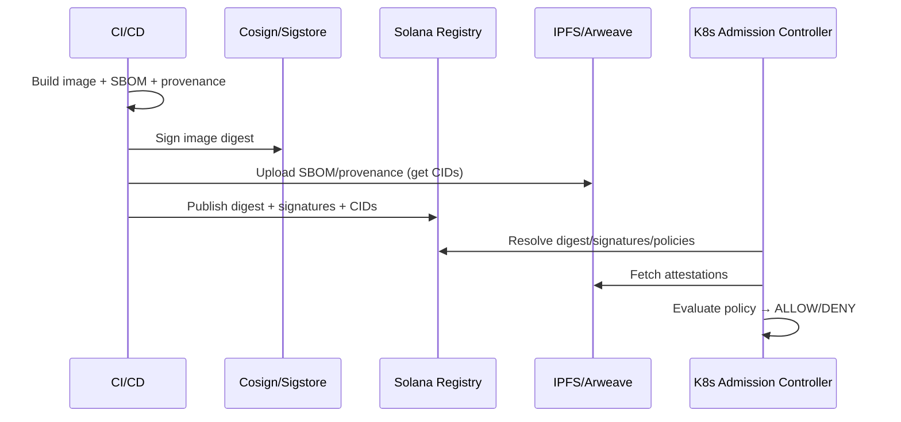

## Workflow CI → Cosign → Solana → K8s

```mermaid
sequenceDiagram
    participant CI as CI/CD
    participant COSIGN as Cosign/Sigstore
    participant SOL as Solana Registry
    participant IPFS as IPFS/Arweave
    participant K8S as K8s Admission Controller

    CI->>CI: Build image + SBOM + provenance
    CI->>COSIGN: Sign image digest
    CI->>IPFS: Upload SBOM/provenance (get CIDs)
    CI->>SOL: Publish digest + signatures + CIDs
    K8S->>SOL: Resolve digest/signatures/policies
    K8S->>IPFS: Fetch attestations
    K8S->>K8S: Evaluate policy → ALLOW/DENY
```

